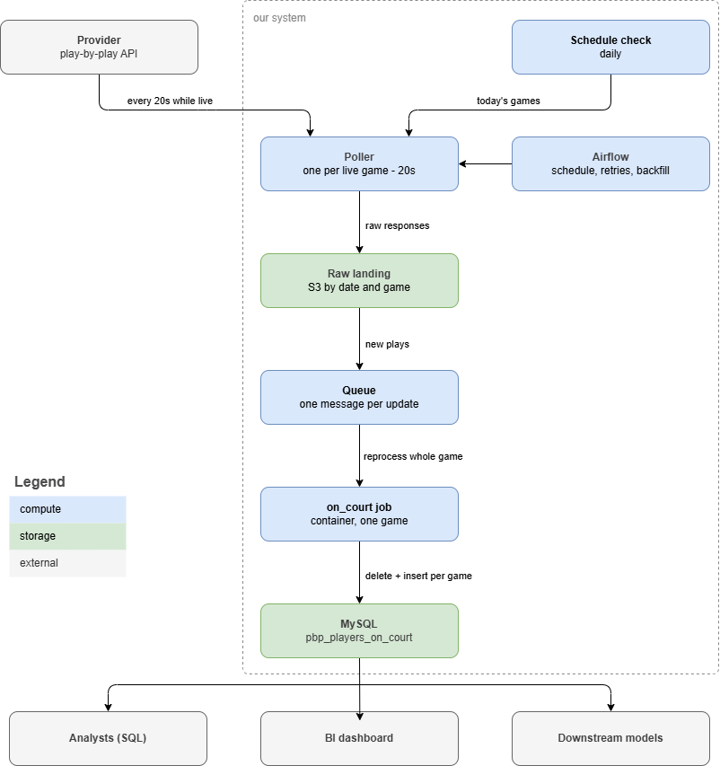

# Part 2: system design

## Assumptions

I have the script from Part 1 and a play-by-play REST API. Everything else here is something I would build.

I am assuming the provider also exposes a schedule endpoint and rosters, since the script needs rosters and something has to tell the system which games exist. Plays show up in the API within a few seconds of happening. On a busy night there are about a dozen games running at once.

## Architecture

A daily job reads the schedule and knows which games are on. When a game tips off, a poller starts calling the play-by-play endpoint for that game every 20 seconds and writes every response to object storage exactly as it came back. Each new batch of plays puts a message on a queue. A worker picks up the message, runs the script for that one game, and writes to MySQL.

Nothing is transformed before it lands. The raw responses are kept, so if I find a bug in the period-opener logic next month I can rebuild the whole season from what I already have. Refetching would not work anyway, since providers correct plays after the fact and the API would likely hand back something different than what I originally computed from.

## Triggering

There is one scheduled job. It runs once a day and reads the schedule to find that day's games.

Everything after that is triggered. The poller starts at tip-off and stops at the buzzer. When it writes new plays it puts a message on the queue, and the compute job picks that up.

The alternative was a cron that recomputes everything every few minutes. That burns work on finished games and still lags live ones by up to the interval.

## Compute

The job runs for one game. It reads that game's raw plays, runs the same functions as `--game <event_id>`, and writes the result.

Running this live has a wrinkle. The period-opener rule needs a player to show up in a period before it knows he was on the floor. Three minutes into a quarter I might have evidence for three of the five, so the lineup is not settled until enough plays have happened.

The job reruns the whole game every time new plays land. The write deletes that game's rows and reinserts them, so a rerun just replaces what was there. A lineup that only had three players resolved at 9:00 gets the other two once they touch the ball. A game is 500 plays and takes about a second.

`validate` runs before the write. If a period does not resolve to five players the job fails and the previous version of the game stays in the table. That check doubles as the pipeline's health signal. A game that keeps failing validation is a game where something changed in the feed.

## Storage and serving

Raw API responses go to S3, partitioned by date and game. They are never edited.

`pbp_players_on_court` and the source tables go to MySQL. Queries against it are joins on `event_id` and `play_id`, which is what the two indexes cover.

Analysts query MySQL directly and a BI tool reads the same table. Anything that needs lineup context, like a model doing on-off splits, joins to it.

## Scaling

A season is about 1,230 games and 615,000 plays, so roughly 6 million rows. That is small enough for MySQL.

Twelve games at 7pm means twelve pollers and twelve compute jobs running at once. Each game is independent, so more games just means more workers.

The first thing to break would be the provider's rate limit. If polling every 20 seconds across twelve games is too much, the fix is one poller batching game IDs into a single call, assuming the API supports it.

## Tools and alternatives

| job | choice | why |
|---|---|---|
| orchestration | Airflow | schedule, retries and backfill in one place, and backfill is what I would use most |
| poller and compute | containers on ECS | one image, scales per game, nothing running between games |
| queue | SQS | keeps a slow compute job from blocking ingestion |
| raw storage | S3 | cheap and replayable |
| serving | MySQL | matches Part 1 and the data is small |

Spark would be overkill. Six million rows a season does not need a cluster, and the per-game jobs are small enough to run in one process.

I would move serving to Postgres or a warehouse if analysts started joining this to years of other data. For this table on its own MySQL is enough.